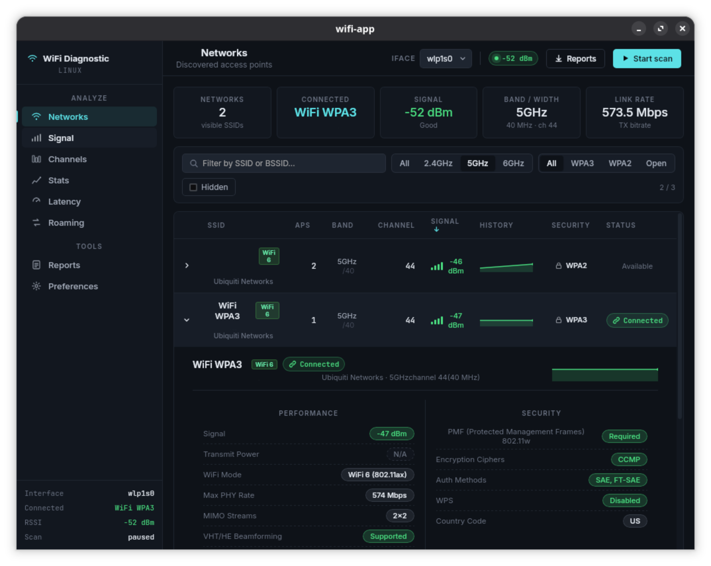

# WiFi App



Cross-platform WiFi diagnostic desktop app built with a Go backend (Wails v2)
and a Svelte frontend. It scans nearby networks, aggregates AP data, and
visualizes signal, channels, and roaming in real time.

> [!WARNING]  
> This app is still in development and may not be fully functional or contain bugs or incomplete features.

More screenshots in the [screenshots](screenshots/) folder.

### Download the Latest Release

- [Linux (amd64)](https://github.com/publicarray/wifi-app/releases/latest/download/wifi-app-linux-amd64)
- [macOS (Universal)](https://github.com/publicarray/wifi-app/releases/latest/download/wifi-app-macos-universal.zip)
- [Windows (amd64)](https://github.com/publicarray/wifi-app/releases/latest/download/wifi-app-windows-amd64.exe)

## Features

- Multi-platform WiFi scanning (Linux, macOS, Windows)
- Real-time network list with AP details and health indicators
- Signal strength over time with roaming markers
- Channel analyzer with congestion and overlap visualization
- Client stats panel (SNR, bitrate, retries, etc.)
- Roaming analysis and AP placement recommendations - WIP Experimental
- Export reports (JSON/CSV)

## Project Structure (high level)

- `main.go` / `app.go`: Wails entry point + bindings
- `wifi_service.go`: scanning orchestration + events
- `wifi_scanner_*.go`: platform-specific scan backends
- `models.go`: shared data structures
- `frontend/`: Svelte UI (Vite)

## Requirements

- Go (Wails v2 toolchain)
- Node.js + npm (frontend build)
- Platform WiFi tools/APIs (see notes below)

## Development

### Full app (Go + Svelte)

```bash
wails dev
```

This starts the Wails dev server and Vite HMR. You can also open
`http://localhost:34115` for browser development with Go bindings.

### Frontend only

```bash
cd frontend
npm install
npm run dev
```

## Building

### Default build

```bash
wails build
```

### Debug run

```bash
wails build -debug
sudo build/bin/wifi-app
```

### Cross-compile example (Windows)

```bash
GOOS=windows GOARCH=amd64 wails build
```

## Platform Notes

- WiFi scanning typically requires elevated privileges.
- Linux uses the `nl80211` netlink backend (no `iw` shell-out).
- macOS uses [CoreWLAN](https://developer.apple.com/documentation/corewlan) via cgo, with an optional Apple80211 helper for advanced beacon data — see [macOS](#macos).
- Windows uses the native WiFi API.

### macOS

**Supported versions.** Built with `LSMinimumSystemVersion = 10.13`. Practically usable on macOS 10.15+ (Catalina); recommended on 14+ (Sonoma). Apple removed the `airport` CLI in 14.4, so the app falls back to `wdutil` / `system_profiler` / CoreWLAN.

**Location Services prompt.** macOS 14+ gates WiFi scanning behind Location Services. On first launch the app calls `requestWhenInUseAuthorization` and the system shows the standard "WiFi App would like to use your location" prompt. Without a grant, CoreWLAN returns blank SSID/BSSID and the network list will be empty. Re-enable from `System Settings → Privacy & Security → Location Services`.

**Apple80211 helper (optional, bundled).** Apple's public CoreWLAN API does not expose raw 802.11 Information Elements, so several advanced fields (BSSColor, BSSLoad, 802.11k/v/r support, DTIM period, WPS, MaxPhyRate, MIMO streams, MLO/EHT capabilities) are unavailable through CoreWLAN alone. The app ships an optional helper, `wifi-app-mac-helper`, that calls the private `Apple80211.framework` via `dlopen`, retrieves the raw IE bytes, and feeds them back into the parser.
  - **Local dev builds** (`wails dev` / `wails build`): the helper is **not** built. To build it locally, run:

    ```bash
    go build -o build/bin/wifi-app-mac-helper ./cmd/wifi-app-mac-helper
    ```

    The main app finds it as long as it sits next to the main binary at runtime.

## Events and UI

- Backend emits runtime events (e.g. `networks:updated`, `client:updated`)
- Frontend listens in `frontend/src/App.svelte`

## CI

GitHub Actions: `.github/workflows/build.yml` builds Linux/Windows/macOS.
